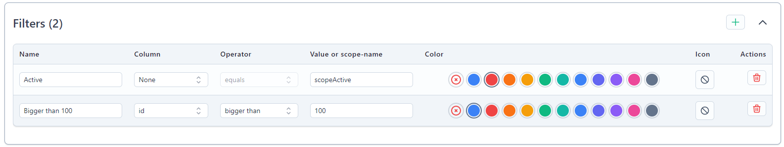

# Lists

Lists are used for browsing a BREAD.

### Ordering items

Click and hold the up/down arrows on the left side of your formfield and move your mouse to the desired positions.

 

### Column

Here you select the column you want to be displayed.  
This can be a regular column in your database, an accessor or even a column from a relationship.

### Title

The title which is shown in the header of the table when browsing your BREAD. This field is translatable.

### Link to

When selected the content of this formfield will be linked to edit or read of this item.  
This also works for relationships if a BREAD exists for the related item.

### Options

#### Searchable

Makes the field searchable.

#### Orderable

Makes the formfield orderable.

#### Ordered by default

When browsing your BREAD, it will be ordered by this formfield by default.


Searching and ordering does **not** work on accessors and ordering does not work on relationship properties because it would require to load **all** results and then searching/ordering through them.


#### Translatable

Check this checkbox if you want this field to be translatable.  
Read more about multilanguage [here](multilanguage.md).

#### Options

Opens a slide-in containing all options of the formfield.

## Filters

Filters are little but powerful buttons shown on top of the browse table.
They allow the user to apply customized queries or scopes to their results.    
By clicking the `+` icon you add filter which you then align to your needs.

 

### Name

The name displayed in the button. This field is translatable.

### Column

The column you want to filter by. Select `None` if you want to use a scope.

### Operator

The operator which will be used in the query.

### Value or scope-name

The value you want to test against, or the name of the scope to use.

### Color

The color of the filter button.

### Icon

Here you can select an icon which is displayed in the filter button.